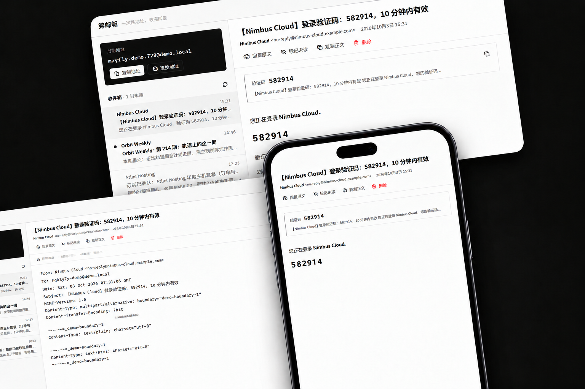

# 蜉蝣邮 · 临时邮箱

<p align="center">
  
</p>

一个简约、黑白灰视觉体系的临时邮箱 Web 客户端。取一个一次性地址，接收验证码，用完即走。

## 运行

```bash
npm install
npm run dev        # 开发（http://localhost:5173）
npm run build      # 生产构建（tsc + vite build）
npm run preview    # 预览生产构建
npm run lint       # oxlint
```

## 数据源与后端接入

应用通过 `src/lib/types.ts` 里定义的 `MailProvider` 接口对接数据源，支持**多个数据源、多个邮箱**并存：
铭牌右上角的「邮箱 n」切换器列出所有邮箱（标注来源与未读数），可新建、切换、移除；
「管理数据源」对话框用于添加/测试/删除自建数据源。

### 内置公共源

- **`src/lib/mailtm.ts`** — mail.tm 公共 API。其 CORS 白名单不允许浏览器直连，
  开发与预览由 Vite 内置代理（`vite.config.ts` 中 `/api → https://api.mail.tm`）转发；
  生产环境用 `VITE_MAIL_API_BASE` 指向自建反代。

### 自建数据源（在「管理数据源」中添加）

| 类型 | 接口契约 | 令牌 |
|---|---|---|
| **Cloudflare Worker**（域名 + Email Routing + Worker 收信，如 `cloudflare_temp_email` 部署） | `GET /open_api/settings`（读域名，旧部署回退 `GET /settings`）、`POST /api/new_address`、`GET /api/mails`、`DELETE /api/mails/{id}` | 管理令牌可选：用于读取设置与删除邮件；收信用地址级 JWT（Worker 返回） |
| **mail.tm 兼容** | `GET /domains`、`POST /accounts`、`POST /token`、`GET /messages`、`GET /messages/{id}`、`GET /messages/{id}/download`、`PATCH /messages/{id}` | 静态令牌可选：填写后所有请求带 `Authorization: Bearer <token>` 并跳过 `/token` 登录（适配带网关令牌的后端）；留空则走 mail.tm 原生登录 |

实现分别位于 `src/lib/cloudflare.ts`（含轻量 MIME 解析 `src/lib/mime.ts`，从原始报文提取正文/验证码）与 `src/lib/mailtm.ts`。

注意事项：

- 浏览器直连自建地址需要后端开启 CORS；HTTPS 页面无法请求 HTTP 接口（混合内容限制），
  必要时请用反向代理把自建源挂在同源路径下。
- Cloudflare 源没有服务端「已读」概念，已读/未读状态保存在本机 localStorage。
- 凭据（地址/密码/JWT/令牌）只保存在浏览器 localStorage，不经过任何第三方。

### 演示模式

- **`src/lib/demo.ts`** — 仅当无法连接邮件服务（或访问 `?demo=1`）时启用，
  界面有明确的「演示模式」横幅与「演示」状态标记，全部为本地模拟数据，不冒充真实邮件。

## 功能

- **多数据源 / 多邮箱**：多个自建源并存，每个邮箱标注所属来源与未读数；切换、新建（可选源）、移除
- **历史保留**：更换地址后，旧邮箱移入顶栏「历史」保留 **24 小时**——期间仍能收信、可随时切回去查看，
  到期自动删除；保留期内面板显示剩余时间，也可手动立即删除
- 一键复制地址（含复制反馈）、15 秒自动轮询收件箱（页面隐藏时暂停）、手动刷新
- 更换地址（确认对话框，旧地址作废提示）、过期/限流/断网等状态的明确反馈
- 邮件列表：发件人、主题、摘要、时间、未读圆点 + 加粗（不单靠颜色区分）
- 验证码识别：4~8 位数字与字母数字混合码，带误报排除（日期/金额/电话/订单号/URL）
  与关键词上下文评分；多个候选值可展开查看；不可靠时如实显示「未识别」
- 查看原文：完整 MIME 报文（含邮件头），可复制、可下载 .eml；服务端不支持时如实标注
- 浅色 / 深色主题（跟随系统偏好，手动切换后记忆），邮件正文 iframe 同步适配
- 响应式：桌面双栏，≤900px 单栏 + 阅读层滑入，触屏设备加大触控目标
- 深链：`#/m/<邮件id>` 可直达邮件，浏览器返回键行为一致

## 结构

```
src/
  lib/        数据适配层（types / mailtm / cloudflare / demo）
              与业务逻辑（验证码识别、MIME 轻解析、HTML 消毒、时间、剪贴板）
  hooks/      useTheme（主题记忆）、useMailbox（多源多邮箱状态机：建号/恢复/切换/轮询/开通等待/深链）
  components/ AddressPlate（地址铭牌）、MailboxSwitcher（邮箱切换器）、SourceDialog（数据源管理）、
              MailList、Reader、CodeStrip、RawView、ConfirmDialog、Toast
  styles/     tokens.css（设计令牌：灰阶、字体、间距、双主题）+ app.css（组件样式）
```

## 设计说明

视觉方向为「精密仪表」：严格中性灰阶，唯一反色元素是邮箱地址铭牌
（浅色主题黑底白字、深色主题反转），字体为 IBM Plex Sans + IBM Plex Mono
（后者只用于地址、验证码、原文等可复制的字面量）。开发过程遵循
frontend-design / ui-ux-pro-max / web-design-guidelines 三个 Skills 的规范，
并通过 Vercel Web Interface Guidelines 做了交付前审查。
